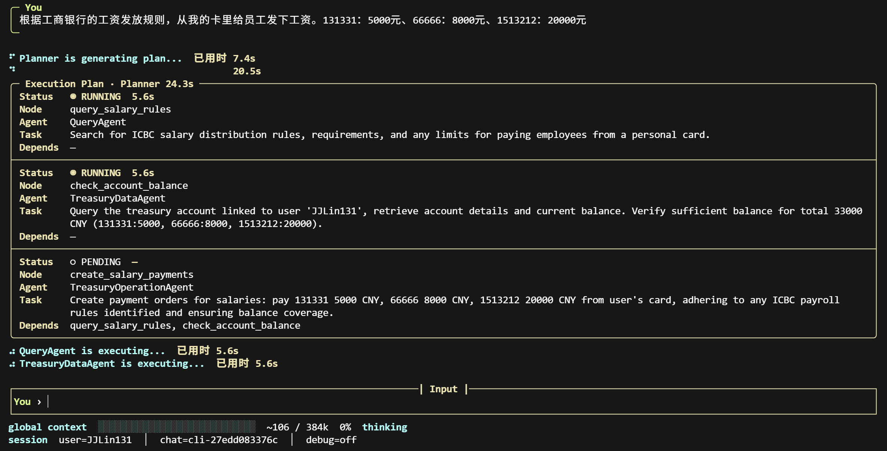
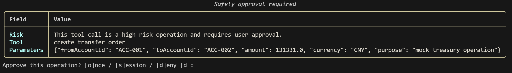
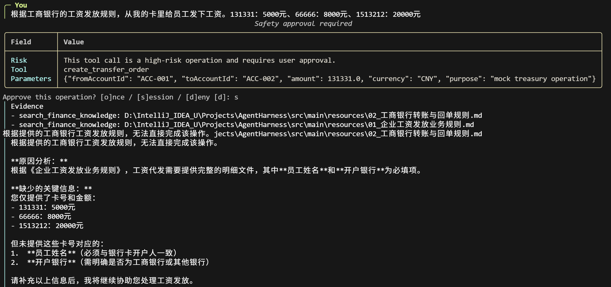
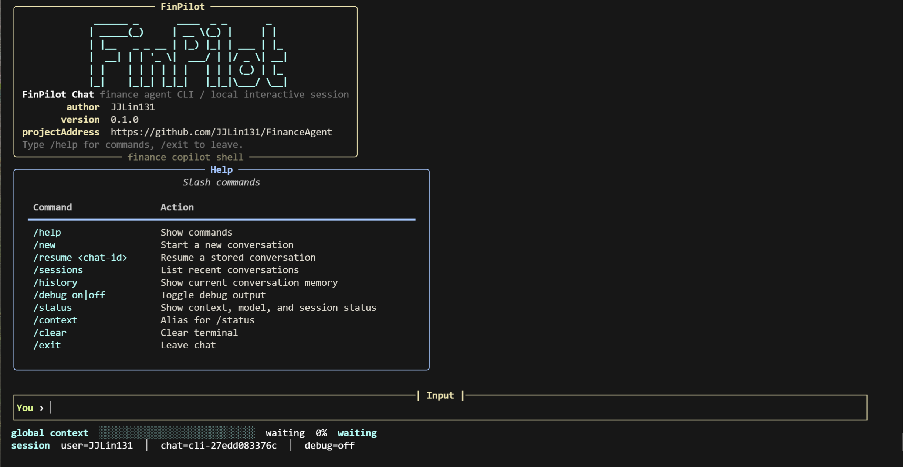

<p align="center">
  
</p>

<p align="center">
  
  
  
  
</p>

# FinPilot

FinPilot 是一个面向企业财资管理场景的智能 Agent 原型。系统能够理解自然语言任务，完成财资知识问答、账户与交易数据查询、受控模拟操作，并通过多 Agent 协作、安全审批和审计记录保证执行过程可追踪。

> [在线查看 FinPilot 项目展示页](https://finpilot-showcase.pages.dev/)

## 核心功能

| 功能 | 说明 |
| --- | --- |
| 财资知识问答 | 根据企业制度、银行规则和财资知识回答业务问题，并给出可追溯依据。 |
| 财资数据查询 | 查询账户、余额、交易流水、回单状态和资金池头寸等信息。 |
| 受控模拟操作 | 支持创建付款单、转账单和下载回单，用于验证操作链路，不处理真实资金。 |
| 多任务协作 | 将复杂请求拆分为知识检索、数据查询和业务操作等任务，按依赖关系协调执行。 |
| 会话与用户记忆 | 保留多轮对话上下文和用户级信息，支持连续任务处理。 |
| 安全与审计 | 对输入、工具参数、操作风险、工具结果和最终回答进行审查，并记录审批与调用过程。 |

## 工作流程


Planner 根据用户目标生成执行计划。相互独立的只读任务可以并行处理，付款和转账等操作任务按顺序执行；当前置任务失败或被安全策略阻断时，依赖任务不会继续执行。所有 Agent 结果最终由统一回答节点进行汇总。

## 运行效果

以下截图来自 [FinPilot Showcase](https://finpilot-showcase.pages.dev/)，展示同一笔工资代发请求从计划生成、风险审批到证据回答的主要运行链路。

### 多 Agent 执行计划

Planner 将工资规则检索、账户余额校验和付款创建拆分为 DAG 节点。独立的只读任务由 QueryAgent 与 TreasuryDataAgent 并行执行，操作节点等待前置任务完成后再进入执行阶段。

<p align="center">
  
</p>

### 高风险操作审批

付款和转账等高风险工具调用会暂停执行，并展示风险原因、工具名称及关键参数，等待用户按单次或当前会话范围确认。

<p align="center">
  
</p>

### 基于证据的最终回答

系统汇总企业制度和银行规则等检索证据，说明操作无法直接完成的原因，并明确列出继续执行前需要补充的信息。

<p align="center">
  
</p>

## 项目架构

| 模块 | 职责 |
| --- | --- |
| FastAPI / CLI | 提供 HTTP 接口、单次问答和交互式会话入口。 |
| LangGraph | 管理输入审查、上下文、规划、执行、回答和审计流程。 |
| Planner / DAG | 拆分复杂任务，校验依赖关系并调度专业 Agent。 |
| QueryAgent | 处理财务制度和财资知识问答。 |
| TreasuryDataAgent | 处理账户、余额、流水和资金池等只读查询。 |
| TreasuryOperationAgent | 处理付款、转账和回单下载等受控操作。 |
| RAG / Memory | 提供知识检索、会话记忆和用户级长期记忆。 |
| Safety / Observability | 提供审批、脱敏、审计、链路追踪和能力评测。 |

## 快速启动

### 环境要求

- PowerShell 7
- Python 3.12+
- MySQL
- Docker Desktop（使用容器部署时需要）
- DeepSeek API Key，或已配置的本地模型服务

### 本地启动 API

```powershell
python -m venv .venv
.\.venv\Scripts\python.exe -m pip install -e ".[dev]"
Copy-Item .env.example .env
```

编辑 `.env`，至少配置模型、MySQL 和 `MEMORY_ENCRYPTION_KEY`，然后执行：

```powershell
.\.venv\Scripts\finpilot.exe doctor
.\.venv\Scripts\finpilot.exe knowledge bootstrap
.\.venv\Scripts\finpilot.exe serve
```

服务启动后可访问：

- API：`http://localhost:8099`
- 健康检查：`http://localhost:8099/healthz`
- 就绪检查：`http://localhost:8099/readyz`

### 启动交互式 CLI

```powershell
.\.venv\Scripts\finpilot.exe chat --user-id user-1
```

<p align="center">
  
</p>

也可以直接执行单次问答：

```powershell
.\.venv\Scripts\finpilot.exe ask "工资发放审批规则是什么？" --user-id user-1
```

### Docker Compose 启动

准备 `.env` 后启动 FinPilot 及观测组件：

```powershell
docker compose --profile app up --build -d
docker compose ps
```

停止服务：

```powershell
docker compose --profile app down
```

### 本地运行展示页

```powershell
Set-Location web
npm install
npm run dev
```

本地开发地址通常为 `http://localhost:5173`，线上版本见 [FinPilot Showcase](https://finpilot-showcase.pages.dev/)。

## 项目结构

```text
finpilot/                 Python 服务与 Agent 核心代码
├── agent/                Planner、DAG、SubAgent 与工具
├── context/              上下文构建、预算与压缩
├── memory/               会话及用户记忆
├── rag/                  知识导入与混合检索
├── safety/               安全审查、审批与脱敏
├── evals/                评测执行与指标统计
└── observability/        审计与链路追踪
tests/                    Python 自动化测试
evals/                    评测数据、发布门禁与报告
web/                      React 项目展示页
docker/                   可选本地 AI 服务
compose.yaml              FinPilot 与观测组件编排
```

## 验证

```powershell
.\.venv\Scripts\python.exe -m pytest -q
.\.venv\Scripts\python.exe -m ruff check .
```

前端验证：

```powershell
Set-Location web
npm test
npm run build
```

## 使用说明

FinPilot 当前重点是验证智能编排、知识检索、记忆、安全治理和可观测性。仓库中的账户、付款和转账能力使用模拟数据或模拟执行器，不应被视为可直接处理真实资金的生产系统；接入真实业务系统前，应补充身份认证、权限控制、密钥管理和生产级审批流程。
