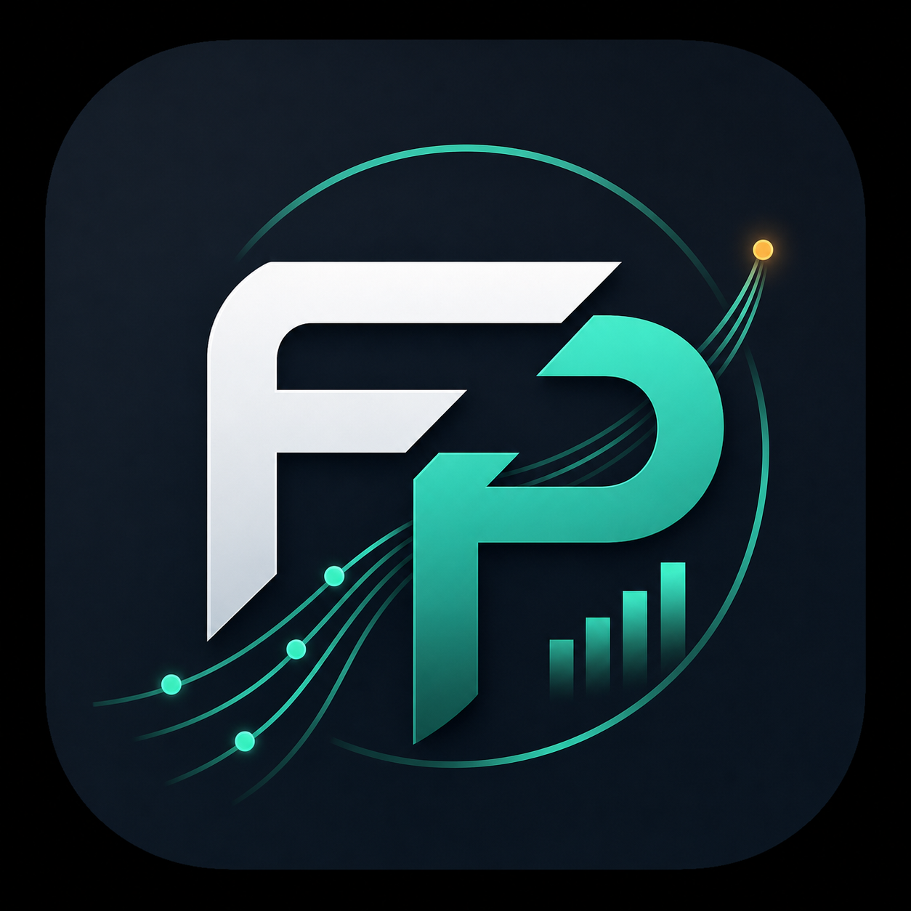
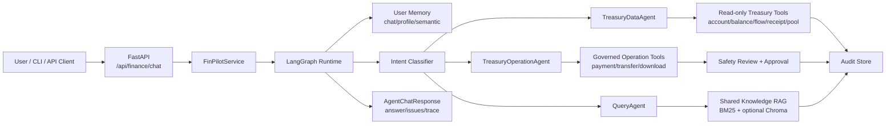
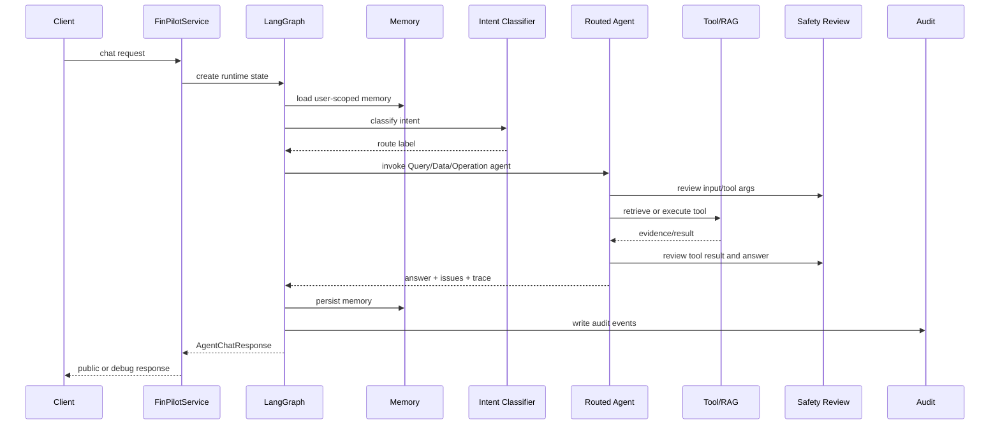

<p align="center">
  
</p>

<p align="center">
  
  
  
  
</p>

# FinPilot

FinPilot 是一个面向企业财资管理场景的智能系统原型。它通过 `FastAPI + LangGraph + RAG + memory + audit + observability` 组织多 Agent 流程，提供业务知识问答、财资数据查询、受控模拟操作、安全审查、评测 smoke 和运行时健康检查。

当前项目重点是 Agent 编排层和治理底座：业务对象、真实账户/流水/付款/回单等后端能力会由外部系统提供，FinPilot 通过工具接口接入。仓库内的资金操作工具是模拟执行器，用于验证意图识别、工具调用、安全审查、审批和审计链路，不应被当作真实资金处理系统直接上线。

## 目录

- [核心能力](#核心能力)
- [系统架构](#系统架构)
- [Agent 与意图](#agent-与意图)
- [快速开始](#快速开始)
- [API 示例](#api-示例)
- [配置与部署](#配置与部署)
- [评测与观测](#评测与观测)
- [安全治理](#安全治理)
- [项目结构](#项目结构)
- [排障手册](#排障手册)
- [路线图](#路线图)

## 核心能力

| 能力 | 当前状态 | 说明 |
| --- | --- | --- |
| 业务知识问答 | 可用 | 基于共享知识库、BM25、可选向量检索和答案生成，适合财务制度、财资知识、流程解释。 |
| 财资数据查询 | 可用，模拟数据 | `TreasuryDataAgent` 暴露余额、账户、流水、回单状态、资金池信息等只读工具。 |
| 财资操作办理 | 可用，模拟执行 | `TreasuryOperationAgent` 暴露付款、转账、单据下载等操作工具，并进入安全审查与审批链路。 |
| 安全审查 | 可用 | 输入、工具参数、工具结果、最终回答均可产生结构化 finding、issue 和审计记录。 |
| 可观测性 | 可用 | 支持健康检查、readyz、审计表、OpenTelemetry、Langfuse 可选集成。 |
| 评测闭环 | 可用，轻量 | JSONL smoke 覆盖 routing、tool use、RAG retrieval、grounded answer、safety。 |

## 系统架构



FinPilot 的边界是“智能编排与治理”。真实财资主数据、账户余额、流水、付款指令、单据文件等应来自后端业务系统；Agent 层负责识别意图、选择能力、调用工具、审查风险、组织回答和记录审计。

## LangGraph 流程



## Agent 与意图

| 意图 | Agent | 典型问题 | 说明 |
| --- | --- | --- | --- |
| `FINANCE_KNOWLEDGE_QA` | `QueryAgent` | “工资发放审批规则是什么？” | 财务/财资知识统一走知识问答，不再单独拆一个 treasury knowledge intent。 |
| `GENERAL_KNOWLEDGE_QA` | `QueryAgent` | “解释一下资金池的概念。” | 通用知识咨询也由知识问答 Agent 处理。 |
| `TREASURY_DATA_QUERY` | `TreasuryDataAgent` | “查询 1001 账户余额。” | 只读数据查询，工具默认不触发高风险操作审批。 |
| `TREASURY_OPERATION` | `TreasuryOperationAgent` | “发起一笔付款单。” | 操作类能力，按工具定义中的 `risk_level` 进入审查和审批。 |
| `UNKNOWN` | fallback | “帮我做一个无关任务。” | 无法识别或不支持的请求会返回结构化 issue。 |

工具按 Agent 可见性隔离，而不是把每个后端服务都拆成一个 Agent。数据查询和资金操作分开，是为了把只读链路和变更链路的校验、审批、审计强度区分开。

## 快速开始

### 环境要求

- Python 3.12+
- Docker Desktop
- MySQL，默认数据库名 `work_memory`
- 使用 DeepSeek 时需要 `DEEPSEEK_API_KEY`
- 可选本地 AI 服务：
  - Ollama：`11434`
  - Chroma：`8000`
  - reranker：`8081`

### 本地启动

```powershell
python -m venv .venv
.\.venv\Scripts\python.exe -m pip install -e ".[dev]"
Copy-Item .env.example .env
.\.venv\Scripts\finpilot.exe doctor
.\.venv\Scripts\finpilot.exe serve
```

健康检查：

```powershell
curl http://localhost:8099/healthz
curl http://localhost:8099/readyz
```

`/healthz` 只表示进程存活。`/readyz` 会轻量检查 MySQL、BM25、Chroma、embedding、reranker 和 LLM 配置，不执行昂贵推理。显式禁用的依赖会返回 `ok` 且 `detail=disabled`；启用但不可用的依赖会返回 `degraded` 或 `failed`。

### CLI 使用

```powershell
.\.venv\Scripts\finpilot.exe ask "工资发放审批规则是什么？" --user-id user-1
.\.venv\Scripts\finpilot.exe chat --user-id user-1
```

交互命令：

```text
/help
/new [chat-id]
/debug on
/context
/clear
/exit
```

初始化共享知识资源：

```powershell
.\.venv\Scripts\finpilot.exe knowledge bootstrap
```

## API 示例

### 对话

```powershell
curl -X POST http://localhost:8099/api/finance/chat `
  -H "Content-Type: application/json" `
  -H "X-Debug-Trace: true" `
  -d '{
    "user_id": "user-1",
    "chat_id": "chat-1",
    "content": "查询 1001 账户余额，并说明是否存在异常。"
  }'
```

未设置 `X-Debug-Trace: true` 时，路由调试、检索调试、工具调用细节和 `safety_findings.detail` 不会暴露给公开响应。公开响应保留 finding code、reviewer、action、message、severity，便于客户端展示和排障。

### 知识导入

```powershell
curl -X POST http://localhost:8099/api/knowledge/documents `
  -H "Content-Type: application/json" `
  -d '{
    "document_id": "finance-rule-001",
    "domain": "FINANCE",
    "title": "工资发放审批规则",
    "source": "manual",
    "content": "工资发放通常需要提交审批并完成财务复核。",
    "tags": ["工资", "审批"]
  }'
```

导入链路会写入 MySQL 知识文档表、BM25 索引，并在向量服务可用时写入 Chroma。

## 配置与部署

复制根目录 `.env.example` 到 `.env` 后再启动服务。示例里的 MySQL、Langfuse、MinIO、Redis、ClickHouse 密钥仅用于本地开发；当 `APP_ENV != local` 时，FinPilot 会拒绝空 DeepSeek key 和已知本地默认密钥。

```powershell
docker compose --env-file .env config --quiet
docker compose up --build
```

默认端口：

| 服务 | 地址 |
| --- | --- |
| FinPilot API | `http://localhost:8099` |
| Langfuse UI | `http://localhost:3000` |
| OTel HTTP receiver | `http://localhost:4318` |
| MinIO API | `http://localhost:9090` |

可选本地 AI lab：

```powershell
docker compose --profile ai-lab up --build
```

独立 AI lab compose 文件位于 `docker/` 时，复制 `docker/.env.example` 到 `docker/.env`。`docker/.env` 不应提交到 Git。

## 评测与观测

基础验证：

```powershell
.\.venv\Scripts\python.exe -m pytest -q
.\.venv\Scripts\python.exe -m ruff check .
```

评测 smoke：

```powershell
.\.venv\Scripts\python.exe -m pytest tests\test_eval_datasets.py -q
```

评测数据位于 `evals/datasets`，覆盖 routing、tool use、RAG retrieval、grounded answer、safety。Safety case 使用 `expected_safety_action` 和 `expected_safety_code` 表达预期行为；`threat` 只是攻击类型元数据。Langfuse 是可选观测与评测记录后端，本地 smoke 不依赖真实外部服务。

## 安全治理

FinPilot 在四个位置执行安全审查：

- 输入审查：路由前识别 prompt injection、危险意图和不支持请求。
- 工具参数审查：执行前基于工具定义的 `risk_level`、参数和上下文判断是否阻断或要求审批。
- 工具结果审查：防止工具返回内容携带泄露、注入或不可公开信息。
- 最终回答审查：持久化和返回前检查幻觉、越权披露和安全 finding。

审批复用范围包含 `user_id + chat_id + tool_name + finding_code + 参数指纹 + expires_at`，避免一次审批被过度复用。`transfer_mock_funds` 仅作为本地演示风险工具保留在注册表中，默认不暴露给普通 Finance QA 上下文。

## 项目结构

```text
finpilot/
  agent/              # LangGraph runtime, sub-agents, tools, safety, audit hooks
  evals/              # eval runner and schema helpers
  config.py           # application settings and production guardrails
  service.py          # API/CLI service boundary
tests/                # unit and smoke tests
evals/datasets/       # JSONL smoke datasets
docker/               # optional local AI lab compose config
observability/        # OTel/Langfuse related config
web/                  # product showcase frontend and shared visual assets
```

## 排障手册

| 现象 | 检查项 |
| --- | --- |
| DeepSeek 相关能力不可用 | 检查 `DEEPSEEK_API_KEY`，以及 routing、RAG curation、safety response 是否配置为 DeepSeek。 |
| `/readyz` 中 BM25 degraded | 运行 `finpilot knowledge bootstrap`，或确认 `BM25_INDEX_PATH` 指向有效索引。 |
| Chroma / embedding degraded | 启动 AI lab profile，或设置 `VECTOR_ENABLED=false` 使用 BM25-only 本地模式。 |
| reranker degraded | 启动 reranker 服务，或设置 `RERANKER_ENABLED=false`。 |
| 请求被安全审查阻断 | 查看 `issues`、`safety_findings` 和审计记录；只在可信诊断环境使用 `X-Debug-Trace: true`。 |
| eval 失败 | 先运行 `tests/test_eval_datasets.py` 检查 JSONL schema，再检查 intent、tool、safety、document id 预期。 |

## 路线图

- 接入真实财资后端：账户、余额、流水、回单、资金池、付款、转账、单据文件。
- 增加登录、鉴权、用户权限和管理员能力边界。
- 将模拟操作工具替换为受控 HTTP 后端适配器。
- 扩展企业级业务规则校验与流程编排。
- 将 smoke eval 提升为发布门禁，并在数据集稳定后再引入更完整的 prompt/eval 工具链。

## 非目标

本轮项目不改变 `/api/finance/chat`、`/api/knowledge/*`、`/internal/evals/*` 的鉴权行为，也不把模拟付款/转账工具声明为真实资金处理能力。
